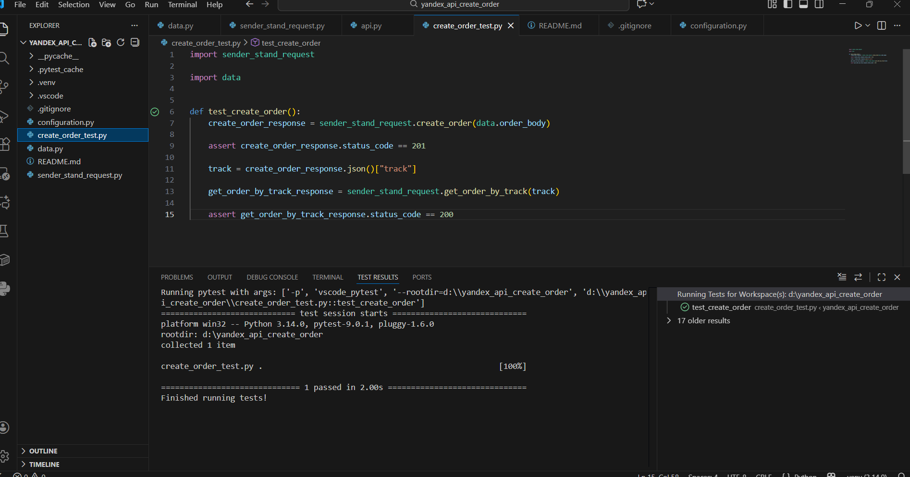

# Курс: "Инженер по тестированию  расширенный."<br>Дипломный проект. Практический блок: вторая часть.


- База данных: Задание 1 и Задание 2. 
- Автоматизация теста к API.


## Структура проекта

- `configuration.py` - конфигурационные параметры
- `sender_stand_request.py` - модуль с функциями для отправки HTTP-запросов к API
- `data.py` - модуль с тестовыми данными (тело создания заказа )
- `create_order_test.py` - основной файл с тестовыми случаями
- `README.md` - документация проекта

## Работа с базой данных.

### Задание 1.
Представь: тебе нужно проверить, отображается ли созданный заказ в базе данных.
Для этого: выведи список логинов курьеров с количеством их заказов в статусе «В доставке» (поле inDelivery = true). 

Запрос:
```sql
SELECT c.login, COUNT(*)
FROM "Couriers" AS c
INNER JOIN "Orders" AS o ON c.id = o."courierId"
WHERE o."inDelivery" = true
GROUP BY c.login;
```

Результат выполнения:
```bash
 login  | count
--------+-------
 katta  |     4
 katta1 |     2
(2 rows)
```
### Задание 2.
Ты тестируешь статусы заказов. Нужно убедиться, что в базе данных они записываются корректно.
Для этого: выведи все трекеры заказов и их статусы. 
Статусы определяются по следующему правилу:
Если поле finished == true, то вывести статус 2.
Если поле canсelled == true, то вывести статус -1.
Если поле inDelivery == true, то вывести статус 1.
Для остальных случаев вывести 0.

Запрос:
```sql
SELECT track,
  CASE
    WHEN finished = true THEN 2
    WHEN "inDelivery" = true THEN 1
    WHEN cancelled = true  THEN -1
    ELSE 0
  END AS status
FROM "Orders";
```
Результат выполнения:
```bash
 track  | status
--------+--------
 578619 |      0
 112469 |      1
 822143 |      1
 822143 |      1
 956653 |     -1
 112469 |      2
(6 rows)
```

## Автоматизация теста к API.

1. Создание заказа:

- Отправка POST-запроса с тестовыми данными

- Проверка успешного создания (статус 201)

2. Получение заказа по треку:

- Извлечение номера трека из ответа

- Отправка GET-запроса с параметром track

3. Проверка результата:

- Основная проверка: статус код 200

4. Для запуска теста:

- В файле configuration вставьте URL сервера. 

- В файле create_order_test.py нажмите кнопку Run tests.

Эти шаги позволят отправить запрос к указанному стенду и запустить тест.

Результат 

